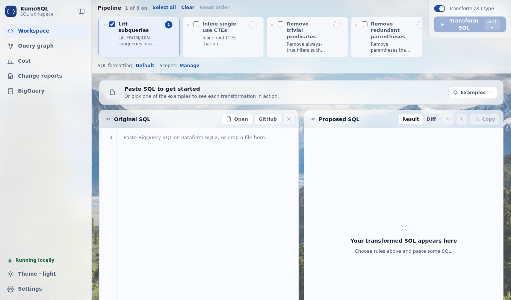
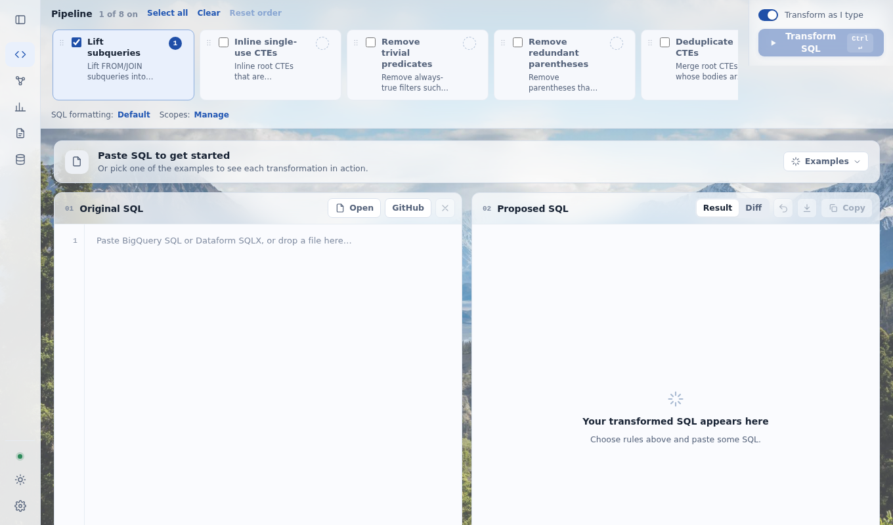

# Getting started

[Plain-language version](../docs_simple/getting-started.md)

KumoSQL helps you change BigQuery SQL and Dataform models with evidence. It gives you Python functions, command-line tools and a local browser UI. It requires Python 3.11 or newer, and it works on Windows, macOS and Linux.

This guide takes you from install to a first useful result in about ten minutes. Nothing here needs a BigQuery account; the optional BigQuery features are at the end.

## 1. Install

Create a virtual environment and install KumoSQL into it.

macOS or Linux:

```shell
python3.11 -m venv .venv
source .venv/bin/activate
python -m pip install "git+https://github.com/walterogozaly/KumoSQL.git"
```

Windows (PowerShell):

```powershell
py -3.11 -m venv "$env:LOCALAPPDATA\kumosql"
& "$env:LOCALAPPDATA\kumosql\Scripts\python.exe" -m pip install "git+https://github.com/walterogozaly/KumoSQL.git"
& "$env:LOCALAPPDATA\kumosql\Scripts\Activate.ps1"
```

pip may warn that the scripts (`kumosql-ui.exe` and others) are installed in a folder that is not on `PATH`. That is harmless: on a locked-down Windows machine where `.exe` files are blocked, skip the launchers and run everything through Python, always as `python -m kumosql COMMAND` (the `kumosql-` prefix is optional): `python -m kumosql ui`, `python -m kumosql rewrite-sql query.sql`, `python -m kumosql pipeline-report demo`. The UI also starts with `python -m kumosql.ui`. This guide always uses the `python -m` form, which works everywhere; the launcher names (`kumosql-ui`, `rewrite-sql`, ...) are optional shortcuts for the same programs. Use the same Python you installed with, for example `& "$env:LOCALAPPDATA\kumosql\Scripts\python.exe" -m kumosql ui`, or `py -3.11 -m kumosql ui` when you installed without a virtual environment.

To install a local checkout instead, run `python -m pip install .` from the repository root. The distribution and the Python import package are both named `kumosql`.

Optional extras add capabilities; install them the same way, for example `python -m pip install "kumosql[smt,execution]"`:

| Extra | Adds | Without it |
| --- | --- | --- |
| `smt` | The Z3 prover for filter, join and `DISTINCT` rewrites the structural prover cannot canonicalize | Those rewrites stay `unproven` |
| `execution` | Local DuckDB for comparing results on synthetic data | The synthetic check reports `not_run` |
| `bigquery` | Google auth for dry runs and the BigQuery catalog page | Those features report that credentials are unavailable |
| `dev` | pytest (with xdist), DuckDB and Z3, for working on KumoSQL itself | |

## 2. Rewrite one query and see the evidence

Save this as `query.sql`:

```sql
SELECT c.id FROM (SELECT id FROM `my-project.analytics.customers` WHERE 1 = 1) AS c
```

Apply two rules in order:

```shell
python -m kumosql rewrite-sql query.sql -r remove_trivial_predicates -r lift_subqueries
```

You get the rewritten SQL and, for every rule, an evidence label:

```text
remove_trivial_predicates: changes=2 verification=proven
lift_subqueries: changes=1 verification=proven
verification=proven
...
WITH __lifted_subquery_001 AS (SELECT id FROM `my-project.analytics.customers`
)
SELECT
    c.id
FROM __lifted_subquery_001 AS c
```

`proven` means the equivalence prover established that the output returns the same rows as the input. Only `unchanged` and `proven` are trusted. Anything else (`planner_checked`, `unproven`, `failed`) is shown as such, and `python -m kumosql rewrite-sql` exits with status 3 for untrusted output unless you pass `--allow-unproven`. Run `python -m kumosql rewrite-sql --help` for the list of rules; the [rewrite rules page](rewrite-rules.md#rewrite-rules) describes each one.

The same thing from Python:

```python
from kumosql import apply_rules

result = apply_rules(["remove_trivial_predicates", "lift_subqueries"], open("query.sql").read())
print(result.verification.status)  # "proven"
print(result.sql)
```

Add `--check-idempotence` to also confirm that running the rules again on their own output changes nothing.

## 3. Analyze a whole pipeline

KumoSQL reads a Dataform project (a folder with `definitions/**/*.sqlx` and `workflow_settings.yaml`) or a plain folder of `.sql` files. To try it, create three small files:

`demo/workflow_settings.yaml`

```yaml
defaultProject: demo
defaultDataset: analytics
```

`demo/definitions/orders_daily.sqlx`

```sql
config { type: "table" }
SELECT o.customer_id, DATE(o.created_at) AS day, SUM(o.amount) AS total
FROM `demo.raw.orders` AS o
GROUP BY 1, 2
```

`demo/definitions/customer_totals.sqlx`

```sql
config { type: "table" }
SELECT customer_id, SUM(total) AS total
FROM ${ref("orders_daily")}
GROUP BY customer_id
```

Ask what would break if you dropped `orders_daily.total`:

```shell
python -m kumosql pipeline-report demo --assess drop_column --target demo.analytics.orders_daily.total
```

The result lists `customer_totals` as `breaks` (it reads the column directly) and anything downstream of it as `indirect`. Anything KumoSQL cannot analyze is listed as `unknown`, never dropped. Without `--assess`, the same command prints the full report (model order, column lineage, dead columns, duplicate and near-duplicate logic, and what the analysis could not see) as JSON; add `-o report.json` to write it to a file.

In Python, `load_sqlx_project("demo")` gives you the same `Pipeline` object, and `find_overlaps`, `find_rollups`, `profile_pipeline` and `infer_roles` answer "is this already done elsewhere?" and "what kind of table is this?" (see [pipeline analysis](pipeline-analysis.md)).

## 4. Use the browser UI

```shell
python -m kumosql.ui --project demo
```

This starts a local server at `http://127.0.0.1:8765/` and opens your browser. Use `--no-browser` to skip opening it, `--port 8766` to pick another port, and Ctrl+C to stop. The console prints the version, Python and git details and one line per background task or git command (add `--verbose` to see every request too); the full log is `ui.log` in the KumoSQL data directory. Both are safe to paste into a chat: repository, project, table, model and file names, folders and your user name are replaced by placeholders such as `repo#1` and `model#417` (look one up on your computer with `python -m kumosql.ui --lookup model#417`; **Settings → Diagnostics → Copy diagnostics** copies a redacted report; `--no-redact` is for local debugging only), and Windows QuickEdit is turned off, so clicking in the console window does not freeze the page (if it ever does, press Esc). The server listens only on `127.0.0.1`, and pasted SQL stays on your computer.

- **Sidebar.** Pages (Workspace, Query graph, Cost, Change reports, BigQuery) are listed down the left; **Settings** and the **Theme** button (system, light, dark) are pinned at the bottom. The panel button at the top collapses it to icons and expands it again, and your choice is remembered.

   
- **Workspace.** Paste BigQuery SQL or Dataform SQLX into **Original SQL** (or use **Open**, or drop a file on the editor). The **Pipeline** strip across the top lists the rules; tick the ones you want and drag them (or use the arrows) to change the order. **Examples** loads a sample for each rule. The result updates as you type; press Ctrl+Enter or **Transform SQL** to run it on demand. The verdict bar shows one label for the whole result, and **Details** shows the evidence behind each step. **Diff** shows which lines changed, and the buttons beside **Copy** download the result or send it back into the editor.
- **Query graph.** With `--project demo` this shows your own models, their readers, the impact of a change (**Assess a change**), column lineage, and tables that already provide the same thing (**Already elsewhere**). The graph opens in **Explorer** view (zoom and pan with the mouse or the + / − buttons, **Fit** for the whole graph, a minimap in the corner, **Focus selection** to show just one asset's upstream and downstream, and **Collapse by dataset** to fold large datasets into one box; click a folded box to open it). The **Dataform tags** filter keeps only assets carrying the ticked `tags` from their config blocks. The wheel zooms quickly, and **Full screen** (top-right of the graph, Esc to exit) fills the screen with the graph. Switch to **Simple** for the original fixed layout. On a large repository the graph shows first; Cost and Change reports say "Analyzing your models" until the background search for repeated work is done. The console prints a timing line for each stage (`analyse: 3.87s`); send those lines along if a load feels slow. A strip warns whenever something could not be analyzed. To use your own repository, open **Settings → Repositories** and connect a Dataform git remote (an https URL such as `https://github.com/owner/repo.git` works for private repositories through your own git credentials, and so does an SSH remote where SSH is allowed). It is saved and reloaded each time KumoSQL starts. `python -m kumosql.ui --git URL` does a one-off load instead.
- **Settings** (bottom of the sidebar, or Ctrl/⌘ + `,`). Appearance, and SQL formatting: keyword case, indentation, line length and the full list of sqlfluff rules, with named configurations you can switch between.
- **Scopes** (*Settings → Scopes*, also linked under the Pipeline strip). Saved rules that limit which models, job rows or tables an analysis covers. Pick the active scope with the *Scope* picker on the Query graph, Cost and Change reports pages.
- **Catalogs** (*Settings → Catalogs*). Saved rules for what your team owns, including BigQuery tables and routines written outside Dataform. The *Dataform repository* catalog is active by default; activate your own to change what the graph, impact and Cost pages treat as yours.
- **Cost** lists repeated work in your models; with job history (**Load job history**, or `python -m kumosql.ui --project demo --jobs jobs.json`) it adds measured cost per asset. **Change reports** compare the loaded git project against another branch (**Compare**). Both show what to load instead of example numbers when they have nothing yet.

Preferences and scopes are saved on your computer; the *Saved state* paragraph in the [UI guide](ui.md) says where and how to change it.

## 5. Compare two versions of a project

```shell
python -m kumosql change-report path/to/base path/to/head -o report.json
python -m kumosql ci-check report.json --comment-out comment.md
```

The first command reports, for every changed model, its evidence label, downstream consumers and any existing table that already provides the same attributes. The second turns that report into a check conclusion and a markdown comment for a pull request. `docs/change-report-workflow.example.yml` shows how to run both in GitHub Actions.

## 6. Optional: BigQuery

Dry runs and the catalog page need Google Application Default Credentials:

```shell
python -m pip install "kumosql[bigquery]"
gcloud auth application-default login
```

`gcloud auth login` alone does not create these credentials. Then:

- `python -m kumosql dry-run original.sql --rewritten rewritten.sql --project my-project` checks that both statements plan and that their output schemas match, without running them.
- `python -m kumosql rewrite-sql query.sql -r remove_trivial_predicates --planner-project my-project` adds the same check to a rewrite.
- With a repository connected, **Settings → Repositories** also loads its Dataform workflow configurations (using the same credentials) and the graph marks models that run in a production schedule; see [production schedules](dataform-repositories.md#production-schedules-dataform-workflow-configurations).
- The **BigQuery** page in the UI lists the projects, datasets, tables and schemas your credentials can see.

Only these features contact BigQuery, and only when you ask. Looking up the columns of tables a project does not define (so `SELECT *` over them can be traced) is off unless you turn it on: tick the checkbox in **Settings → Analysis**, pass `--fetch-schema` to `python -m kumosql pipeline-report`, or set `KUMOSQL_SCHEMA_FETCH=1`. See [whole-pipeline analysis](pipeline-analysis.md).

## Working on KumoSQL itself

```shell
python -m pip install -e ".[dev]"
python tools/run_tests.py        # parallel; --evals for the benchmark floors only
python -m pytest                 # serial
```

`tools/run_tests.py` uses pytest-xdist on every CPU (about 9 minutes instead of 35 on 4 CPUs); see the README's testing section. Use `python -m pytest`, not bare `pytest`, so the repository root is importable. The default run skips the `slow` marker. CI runs the suite on the oldest and newest supported `sqlglot`; `python tools/test_sqlglot_matrix.py` reproduces that locally.

Most of the suite is thousands of small tests, so keep a test's fixed cost low. Load DuckDB rows with `kumosql.duckdb_load.insert_rows` (one statement of literals instead of one `execute` per row) and reuse one connection across a helper's trials (`CREATE OR REPLACE TABLE` gives fresh tables, and a new connection costs about 10 ms). Start a test HTTP server with `serve_forever(poll_interval=0.01)`, or its `shutdown()` waits up to half a second. `tests/conftest.py` gives each test its own state directory without making a `tmp_path` unless the test asks for one.

## Where to go next

- [README](../README.md): the benchmark scoreboard, a summary of every feature and the CLI.
- [UI guide](ui.md), [rewrite rules](rewrite-rules.md), [provers](provers.md), [pipeline analysis](pipeline-analysis.md) (overlap and roll-up detection), [cost and change reports](cost-and-change-reports.md) and [Dataform repositories](dataform-repositories.md).
- [UI roadmap](ui-roadmap.md): which UI area reads which data.
