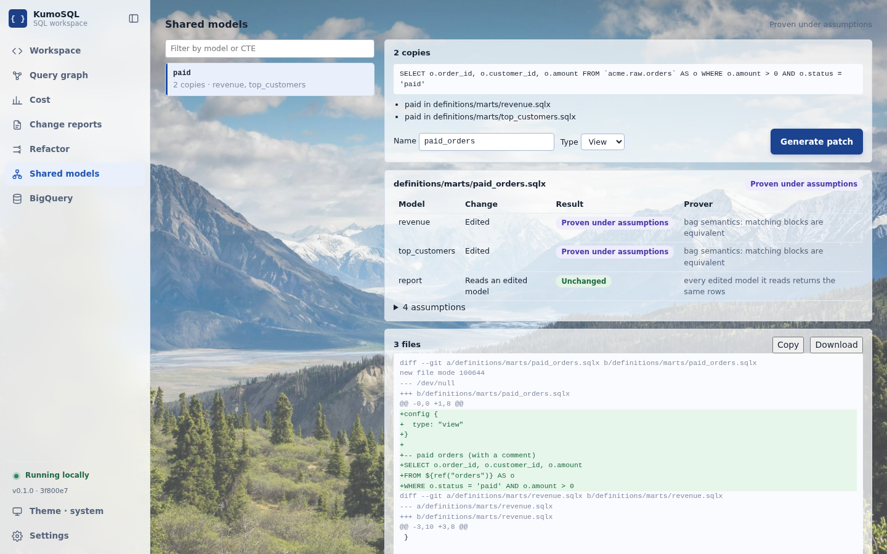

# Shared models: move a repeated CTE into one model

When the same CTE is copied into several Dataform models, KumoSQL can write the patch that moves it into one new model and points every copy at it, then check that patch with the prover. The patch is a reviewable `git apply` diff; nothing is written to the project or to BigQuery.

## Use it

- **UI:** the **Shared models** page lists the repeated CTEs of the loaded project. Pick one, choose the new model's name (default: the CTE name, with `_shared` added when a table of that name exists) and type (**View**, the default, or **Table**), then **Generate patch**. The page shows the new file, the result for every model the patch touches and the full diff (**Copy** or **Download**).
- **CLI:** `python -m kumosql shared-model DIR` lists the repeated CTEs as JSON; `python -m kumosql shared-model DIR ID [--name N] [--kind view|table] [--patch FILE]` prints the patch and its checks and writes the diff to `FILE`. It exits 0 when every edited model is proven (with or without assumptions), 1 otherwise.
- **API:** `GET /api/shared-models` and `POST /api/shared-models/patch` with `{"id", "name"?, "kind"?}`; `kumosql.shared_models.repeated_ctes` and `extract_shared_model` in Python.

## What the patch does

- A new `.sqlx` file next to the first copy, with `config { type: "view" }` (or `"table"`) and the CTE body copied from that copy's source text: comments and `${ref(...)}` calls are kept as written.
- In every model holding a copy, only the CTE body changes, to `SELECT <the copy's columns> FROM ${ref("<new model>")}`. The CTE keeps its name, so the rest of the model is untouched byte for byte.

A view is the default because it runs the same SQL each time a model reads it, as the CTE did: it shares SQL, not computation. A table computes the rows once per run, which saves repeated work but adds storage and a build step; BigQuery may also evaluate a CTE that a query reads twice more than once, so measure before claiming a saving.

## How it is checked

The fingerprint that found the copies is never the result. The project is loaded again with the patch applied, and for each edited model the prover compares the model's query before the patch with its query after it, the new model inlined where it is read. Each model gets one result:

| Result | Meaning |
| --- | --- |
| Proven | The prover showed both queries return the same rows and needed no assumption. |
| Proven under assumptions | Proven, given the assumptions listed with it (for example that FLOAT64 values are never NaN, or that ties in a window's ORDER BY resolve the same way). |
| Differs | The prover found a database on which the two queries return different rows. |
| Unknown | Not shown either way; the reason is listed. |
| Unchanged | A model downstream of edited models, when every edited model it reads through is proven: the tables it reads hold the same rows. It inherits their assumptions. |

The verdict of the patch is its weakest result. A patch whose files do not load (a parse error, a duplicate model) is Unknown.

## Which CTEs are offered

Copies come from the exact-duplicate search (`Pipeline.duplicate_selects`, see [pipeline analysis](pipeline-analysis.md)); only copies that are `WITH` tables of `.sqlx` models are edited, and copies elsewhere (a whole model, a subquery) are listed and left alone. A group can be extracted only when every copy:

- is the only `WITH` table of that name in its file and in its compiled query, and not recursive;
- uses no Dataform expression other than `${ref(...)}` or `${resolve(...)}` with literal names (variables, `when()`, `incremental()` and JavaScript constants can compile differently per model);
- reads no other `WITH` table of its model and no table without a dataset (a view needs dataset-qualified names);
- has no value that changes from run to run (a clock, `RAND`, a UUID);
- names every output column once, the same columns in every copy.

Groups that fail are listed with the reason and cannot be generated. Near duplicates (copies that differ by a literal, a filter or a column) are not extracted yet; their proposals are on the Change reports page.

The loaded project keeps its source files for this (`pipeline.source_files`), so a project parsed before this feature must be reloaded once.
